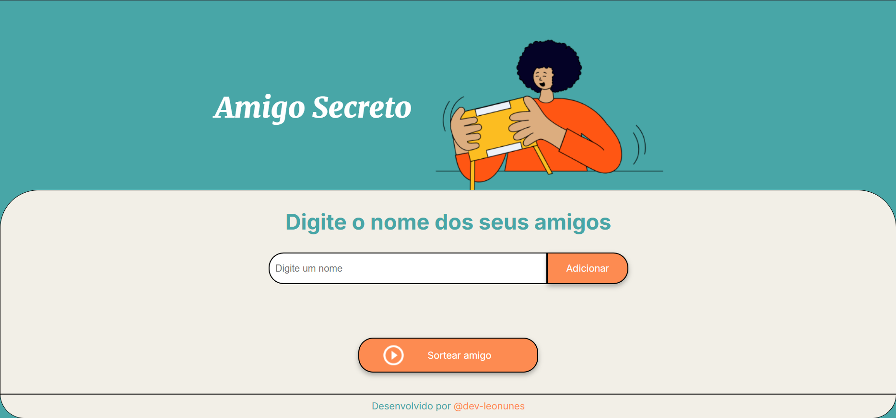

# Challenge Amigo Secreto

## Descrição
Este projeto é um desafio para criar um sistema de amigo secreto. O objetivo é permitir que um grupo de pessoas participe de um sorteio para definir quem será o amigo secreto de quem.



## Deploy
O projeto está disponível no seguinte [link](https://dev-leonunes.github.io/challenge-amigo-secreto/).

## Funcionalidades
- Cadastro de participantes
- Sorteio de amigo secreto
- Visualização dos resultados do sorteio

## Tecnologias Utilizadas
- `HTML`, `CSS` e `JavaScript`

## Contribuição
1. Faça um fork do projeto
2. Crie uma branch para sua feature:
    ```bash
    git checkout -b minha-feature
    ```
3. Commit suas mudanças:
    ```bash
    git commit -m 'Adiciona minha feature'
    ```
4. Faça push para a branch:
    ```bash
    git push origin minha-feature
    ```
5. Abra um Pull Request